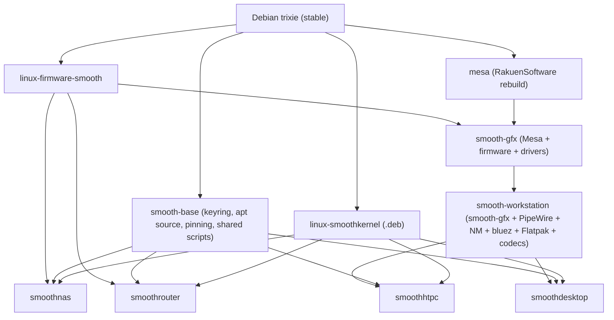

# RakuenSoftware architecture

System-level architecture for the Smooth* family — four Debian-based appliance OSes built on a shared foundation. This doc lives in `smoothkernel` because the kernel is the piece every flavor shares; companion docs in this directory cover the apt repo, graphics stack, per-flavor specs, installer framework, and release model.

## The product family

| Flavor | What it is | Shell / surface |
|---|---|---|
| **SmoothNAS** | Linux storage appliance (mdadm + LVM + ZFS + SMB/NFS/iSCSI) | Headless, web UI |
| **SmoothRouter** | Linux router (nftables + unbound + Kea + wireguard) | Headless, web UI |
| **SmoothHTPC** | HTPC kiosk (boot-to-custom-shell fronting Kodi + emulators) | `smoothtv` shell (Tauri) |
| **SmoothDesktop** | Windows-replacement desktop | KDE Plasma 6 + `smoothdesktop-theme` |

All four run on the same base Debian, the same kernel, the same apt repo. The deltas are userspace.

## Dependency graph



Everything above the flavor row is shared. Only the flavor row diverges.

## Major architectural decisions

### Debian stable, not Ubuntu

Debian `trixie` (Debian 13) as the base for every flavor. Reasons:

- SmoothNAS already ships a custom Debian installer in `iso/`. Ubuntu would orphan that work.
- Debian has cleaner defaults for appliance shipping (no snap pushes, no non-free bundled in ways that complicate licensing).
- The usual "Ubuntu HWE" argument for fresher kernel + Mesa + firmware is moot: `linux-smoothkernel`, `mesa` (rebuilt), and `linux-firmware-smooth` replace exactly what HWE updates — and do it more aggressively.

`non-free-firmware` is a first-class component under Debian 12+. Installers enable it; `smooth-base`'s `postinst` does the same on existing systems.

### One kernel, one binary, all four flavors

`linux-smoothkernel` is a single .deb set installed identically on every flavor. Not per-OS builds.

The flavor-level differences that people intuitively associate with "server vs desktop kernels" are almost entirely userspace-tunable:

- I/O scheduler selection → udev rules per flavor
- VM and network sysctls → `/etc/sysctl.d/` fragments per flavor
- CPU governor defaults → tuned profiles per flavor

Compile-time choices that can't move to userspace (`CONFIG_PREEMPT`, `CONFIG_HZ`) are locked to values that work everywhere with BORE:

- `CONFIG_PREEMPT=y` — full preemption. The throughput cost on I/O-bound NAS workloads is in the noise on modern hardware with BORE.
- `CONFIG_HZ=1000` — latency responsiveness. Negligible server impact.

This collapses kernel build + maintenance from four pipelines to one. See [`KERNEL.md`](KERNEL.md).

### CachyOS as the patch upstream, with Nobara cherry-picks

CachyOS publishes a clean, versioned patch series at `github.com/CachyOS/kernel-patches` designed for downstream reuse. Its patchset (BORE, BBRv3, MM tuning, sched-ext, filesystem improvements) is a strict improvement over mainline for every Smooth* flavor — explicitly including headless NAS and router workloads.

Nobara's patches are entangled with Fedora SRPM build scripts; its HID/controller/OpenRGB bits are worth cherry-picking on top of CachyOS, and they have zero cost on headless systems (drivers only load with the hardware).

See [`KERNEL.md`](KERNEL.md) for the patch intake process.

### BORE scheduler default

One scheduler, not a family. CachyOS offers BORE, sched-ext, EEVDF-tuned, and hardened variants; Smooth* picks BORE only. Reasons:

- Burst-aware behavior suits every flavor (Samba many-client, nftables under load, game input, UI responsiveness).
- Single default means predictable support surface.
- sched-ext support still compiled in for advanced users, just not the default.

### Flavor differentiation lives in userspace, not kernel or base

The per-flavor `-tuning` packages (`smoothnas-tuning`, `smoothrouter-tuning`, etc.) ship only:

- udev rules (I/O scheduler)
- sysctl fragments (network buffers, VM, forwarding, etc.)
- tuned profile (CPU governor)

They're deliberately trivial and independently installable. Someone could put `smoothrouter-tuning` on a bare Debian and get the networking sysctls without any of the router-specific daemons.

### smoothtv for HTPC, KDE for desktop

HTPC gets a custom shell because no good OSS HTPC launcher exists as a coherent product — Kodi's UI is Kodi-specific; Plasma Bigscreen is tied to Plasma. `smoothtv` is a Tauri app built on `@rakuensoftware/smoothgui` that runs inside a wlroots kiosk compositor and launches Kodi / Steam Big Picture / RetroArch as sibling children. Steam Deck / SteamOS pattern.

Desktop does *not* get a custom shell. KDE Plasma 6 is flexible enough that a config-only theme package (`smoothdesktop-theme`) gets 90% of the "polished Windows replacement" feel for maybe 2% of the effort of a custom shell. Save the custom-shell budget for HTPC where it's actually justified.

See [`SMOOTHHTPC.md`](SMOOTHHTPC.md) and [`SMOOTHDESKTOP.md`](SMOOTHDESKTOP.md).

### Apt: suite-per-product + a shared `common` suite

The existing apt repo uses one apt suite per product (`smoothnas`, `smoothrouter`). That's a good shape; extend it with a `common` suite for cross-product packages (`linux-smoothkernel`, `mesa`, `linux-firmware-smooth`, `smooth-base`, `smooth-workstation`, `smoothgui-assets`).

Every flavor's `sources.list` enables its product suite plus `common`:

```
deb <url> common main
deb <url> smoothnas main
```

See [`APT_REPO.md`](APT_REPO.md).

### Override only where Debian stable is actually stale

Debian stable is a feature for 80% of the stack — Samba, NFS, nftables, unbound, Kea, PipeWire, WirePlumber, nginx, systemd, Go/Node toolchains. Ship those as-is.

Override where Debian's freeze hurts:

| Package | Override? | Why |
|---|---|---|
| `linux-smoothkernel` | Always | Kernel is the centerpiece; on CachyOS cadence |
| `mesa` | Always | Debian stable's Mesa lags by a year+; unacceptable for HTPC/desktop GPU features and video decode |
| `linux-firmware-smooth` | Always | New GPUs need firmware blobs Debian hasn't shipped |
| `kodi` | Probably | Yearly upstream cadence; HTPC UX regresses on stale versions |
| `llvm` | Only when forced | Debian 13 ships LLVM 19, enough through most of 2025 |
| `kde-plasma-*` | Only if stable feels too stale | Re-evaluate at ship time |
| Everything else | No | Debian stable is the right posture |

See [`RELEASE_MODEL.md`](RELEASE_MODEL.md) for cadence and promotion.

## Cost ranking

Engineering investment, largest first:

1. **smoothkernel** — perpetual rebase on CachyOS cadence
2. **smoothtv** — greenfield Tauri product + session plumbing
3. **mesa** — quarterly rebuild, occasional LLVM pain
4. **smoothnas debian/ packaging** — wrap existing Makefile, produce .debs
5. **smoothrouter backend + UI** — greenfield but scope-contained
6. **Shared installer extraction** from `SmoothNAS/iso/`
7. **smoothdesktop-theme** — config files only
8. **Meta + tuning packages** — trivial

## What this family is not

- Not a distro in the "new Linux from scratch" sense. It's Debian with an overlay of the specific packages Debian stable under-serves.
- Not a general-purpose desktop distro competing with Ubuntu/Fedora/etc. Each flavor is opinionated for its role.
- Not trying to absorb or replace enterprise products (TrueNAS Enterprise, pfSense Plus, Bazzite). Scope is homelab / workstation / small office.

## Open questions

- **Stable channel model.** Start with a single `main` component per suite; add `testing` for pre-promotion soak once rebase cadence justifies it.
- **Module signing and Secure Boot.** Standardized in [`signing.md`](signing.md): release-built modules are signed in CI, DKMS modules are signed on-host via `smooth-secureboot`.
- **Arm64 support.** All four flavors are amd64-only at v1. HTPC and NAS have the strongest arm64 cases; router is close behind. Deferred.
