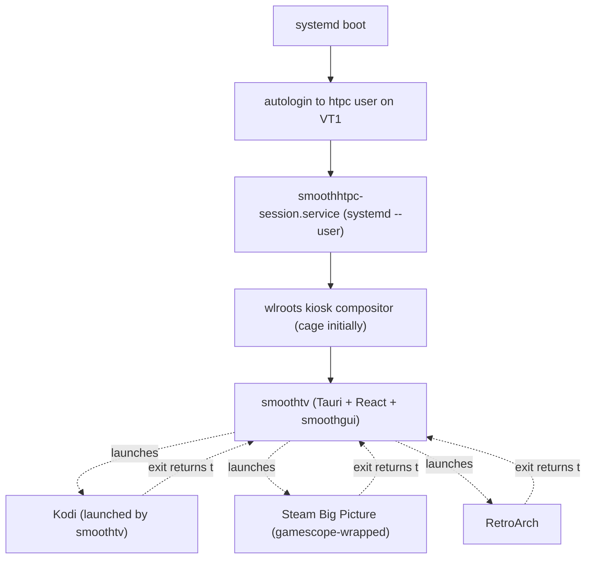

# SmoothHTPC

HTPC flavor. Boots directly into `smoothtv`, a custom Tauri-based shell that fronts Kodi, Steam Big Picture, RetroArch, and other full-screen apps. No desktop environment. No greeter. Single-app kiosk experience, but the "app" is our shell.

## What it is

An appliance OS for an HDMI-attached box (NUC, small-form PC, old desktop) that:

- Turns on, shows the Rakuen splash, lands in `smoothtv`
- Navigates with a remote (IR, BT, phone-as-remote) or a controller
- Launches Kodi for media, gamescope-wrapped Steam for gaming, RetroArch for retro, etc.
- Returns to `smoothtv` cleanly when any child app exits

Competitors: LibreELEC (Kodi-only, too narrow), Bazzite/ChimeraOS HTPC modes (gaming-first, media as an afterthought), Plasma Bigscreen (tied to Plasma, limited adoption). None integrate media + gaming + retro + streaming under one coherent launcher. `smoothtv` does.

## Architecture layers



The Steam Deck / SteamOS pattern: shell as root UI, apps as sibling children in the same compositor session, shell reclaims focus on exit.

## Suite composition (`smoothhtpc` suite)

| Package | Purpose |
|---|---|
| `smoothhtpc` | Meta — pulls workstation base + smoothtv + Kodi + HTPC tooling |
| `smoothhtpc-tuning` | sysctl + udev + tuned |
| `smoothtv` | Tauri shell binary + assets + session unit |

From `common`: `linux-smoothkernel`, `smooth-base`, `smooth-gfx` (via `smooth-workstation`), `smooth-workstation` (via meta).

## Meta-package dependencies

```
Depends:
 smooth-workstation,
 smooth-secureboot,
 smoothhtpc-tuning,
 smoothtv,
 cage,
 kodi,
 kodi-inputstream-adaptive,
 kodi-peripheral-joystick,
 kodi-pvr-iptvsimple,
 cec-utils,
 libcec6,
 ir-keytable,
 bluez,
 networkmanager,
 openssh-server,
 gamescope,
 steam-installer | steam-launcher
Recommends:
 retroarch,
 mangohud,
 gamemode
```

Explicitly NOT pulled: any DE, browser, office suite, file manager, generic desktop apps. `smoothhtpc` is a single-purpose appliance.

Because `apt` resolves dependencies before package `postinst` runs, the HTPC bootstrap path enables Debian `contrib non-free non-free-firmware` and `i386` before `apt install smoothhtpc`. That makes Steam, current Intel decode drivers, and the 32-bit graphics runtime available on first boot instead of as a post-install manual step.

## smoothtv — the shell

### Technology

- **Tauri** — Rust host + system webview (`webkit2gtk-6.0` on Linux)
- **React 19 + TypeScript** — UI via `@rakuensoftware/smoothgui` component library
- **~10MB install footprint** vs Electron's ~120MB. Matters on HTPC hardware.
- **Native Wayland** — runs as a Wayland client in the cage compositor, no Xwayland path

Why Tauri over Electron: memory and disk budget matter for HTPC hardware (NUCs with 4–8GB RAM, SSDs measured in tens of GB). A 10MB Tauri shell leaves headroom for Kodi + Steam; a 120MB Electron shell doesn't. The Tauri ecosystem is newer but stable enough for this use case, and shares the smoothgui React code we already have.

Why not a browser-in-kiosk-mode (Chromium `--kiosk`): adds a browser surface, no way to integrate with system APIs cleanly, and updates on Chromium's cadence which we don't want.

Why not native QML/GTK: loses smoothgui reuse. Rebuilding the component library in QML is a waste.

### Session model

```
smoothhtpc-session.service (systemd --user unit):
    - Type=simple
    - ExecStart=/usr/bin/cage -s -- /usr/bin/smoothtv
    - WantedBy=default.target
    - Restart=on-failure
```

Autologin is configured at the getty level (`systemd autologin` drop-in for `getty@tty1.service`) so the `htpc` user's user-manager starts immediately on login and pulls in `smoothhtpc-session.service`. The user account is `htpc`, UID 1000, no password (locked), SSH-accessible with a key if enabled via the shell's settings.

### Launcher pattern

When smoothtv launches a child app:

1. Smoothtv spawns the child process (Kodi, gamescope+Steam, retroarch) as a subprocess, *not* via `systemd-run` — simpler lifecycle.
2. cage (the compositor) surfaces the child as a new Wayland client. cage's single-client model means smoothtv's window gets hidden (not destroyed).
3. When the child exits, cage re-surfaces smoothtv.
4. Smoothtv detects the child exit via its Rust subprocess-waiter, unblocks the UI, and shows the "welcome back" state on whatever tile the user came from.

For Steam specifically: `gamescope -e -- steam -tenfoot` wraps Steam in a HiDPI-aware Wayland compositor that handles the game's display output cleanly.

For Kodi: launch with `--standalone --windowing=gbm` if cage's rendering path is sub-optimal for Kodi, else normal Wayland; both work.

### Input

Keyboard-focus navigation first. Every interactive element must be reachable with arrow keys + enter/back. This is retrofittable but *painful* if you build a mouse-first UI and add keyboard later; design for it from day one.

Input sources smoothtv handles (via the Tauri webview's standard event APIs):

- **Keyboards / keyboard-emitting IR remotes** — arrow keys, enter, back
- **Bluetooth remotes** (Apple TV, Shield, Fire TV) — paired via bluez, emits keyboard events
- **Game controllers** — SDL2-compatible via the browser Gamepad API; D-pad/A/B map to arrow/enter/back
- **IR receivers** via `ir-keytable` — remapped to keycodes at the kernel/udev level; smoothtv sees them as keyboard events

Future: phone-as-remote. Smoothtv serves a local web UI on the LAN (bound via NetworkManager); users open the URL on their phone, pair with a PIN, and their phone touchscreen becomes a trackpad + keyboard. Built on smoothgui, reuses existing React components.

### Tiles / home surfaces

Initial tile set:

- **Watch** — launches Kodi
- **Game** — launches Steam Big Picture (or a RetroArch / ES-DE sub-picker if we add emulation as first-class)
- **Music** — launches Kodi's music mode (or a dedicated music app in v2)
- **Settings** — smoothtv's own settings UI (display, audio output, network, update, etc.)
- **Power** — sleep, restart, shutdown

Tiles are data-driven; adding a new app type is a config change, not a code change.

### Settings UI

Smoothtv owns the HTPC-level settings surface:

- Display: resolution, refresh rate, HDR toggle, HDMI-CEC on/off
- Audio: output device (HDMI / analog / BT), spatial / passthrough
- Network: NetworkManager via `nmcli`-equivalent calls, wrapped in a remote-navigable UI
- Update: `apt upgrade` for `smoothhtpc` + `common` suites, rebooted when kernel changes
- Storage: total/free disk, mounted media shares

What it does NOT own:

- Kodi library configuration — that's Kodi's domain.
- Steam's internal settings — that's Steam's domain.
- Individual emulator cores — RetroArch's domain.

Smoothtv only configures HTPC-level concerns (display, audio output, network, update, lifecycle); it doesn't try to be a universal settings app for every child app.

## Graphics and firmware posture

Identical to SmoothDesktop. Both pull `smooth-workstation`, which pulls `smooth-gfx`, which pulls the full Mesa stack + `linux-firmware-smooth` + VA/VDPAU/Vulkan drivers. See [`GRAPHICS.md`](GRAPHICS.md).

NVIDIA: same situation as desktop — handled via Debian's non-free nvidia-driver, DKMS-built against `linux-smoothkernel-headers`.

## HTPC-specific tuning (`smoothhtpc-tuning`)

**Sysctl:**

```
vm.swappiness = 60                # desktop-like — interactive, not throughput
vm.max_map_count = 1048576        # games occasionally need more than the 65k default
```

**tuned profile:** CPU governor `schedutil` (balance of responsiveness and power).

**udev:** mq-deadline for SSD, none for NVMe (matches desktop).

## Hardware baseline

- HDMI output, 1080p at minimum, 4K targeted
- Hardware video decode (VA-API for Intel/AMD, VDPAU/NVDEC for NVIDIA)
- HDMI-CEC support (most modern Intel NUCs; some add-in HDMI capture cards don't forward CEC — warn the user)
- Bluetooth for remotes/audio
- IR receiver optional (ir-keytable handles it if present)
- 4GB RAM minimum; 8GB comfortable with Steam running

## Non-goals

- **Being a general-purpose desktop with a bundled HTPC mode.** SmoothHTPC is single-purpose. If you want a desktop with Kodi installed, install SmoothDesktop and add Kodi.
- **Running arbitrary DE applications in the HTPC session.** No browser, no file manager, no generic app launching from `smoothtv` outside the configured tile set.
- **Replacing Kodi's UI.** Kodi is where you browse and play media; smoothtv is the launcher around it, not a replacement.

## Open questions

- **cage vs custom compositor.** cage is the pragmatic starting point (single-client wlroots kiosk, well-tested). A custom smoothtv-specific compositor would let us do things like overlay a "now playing" mini-bar across all child apps, but that's v2+ work. Start with cage.
- **Overlay UX.** Should smoothtv own a global overlay (press home button from inside Kodi → smoothtv's quick menu slides in)? Requires compositor support that cage doesn't have out of the box. Defer to the custom-compositor decision.
- **Emulation first-class.** Is RetroArch a tile, or is there a dedicated "Retro" hub built on ES-DE / Pegasus? Decision pending; doesn't block v1 launcher.
- **Phone-as-remote.** Protocol design (WebSocket over LAN, paired by QR code?) deferred.
